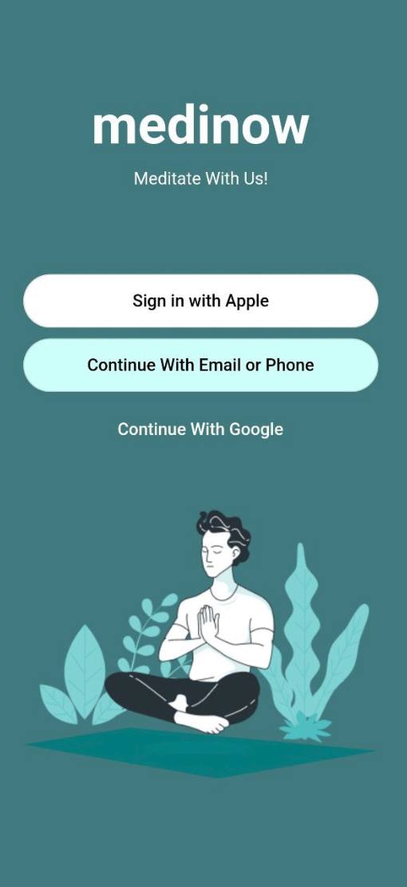

# ПРАКТИЧЕСКАЯ РАБОТА №1
## Тема: Проектирование макетов 
Цель работы: освоение изученного материала, построение макетов.
### Ход работы:
Для размещения тех или иных элементов использую класс Container и задаем уже классу те параметры, которые необходимы. Для отступов использовался параметр padding с различными конструкторами класса таких, как EdgeInsets.only, EdgeInsets.all и т.д. для выравнивания элементов использовался параметр aligment, а для выравнивания текста textAlign. Также чтоб задать стиль тексту необходимо прописать style: TextStyle(), где в скобках мы можем указать такие парметры, как цвет текста, размер и т.д.
Кнопки в макете «Welcome» закруглённые, т.е. используется OutlinedButton, а чтобы прописать радиус их округления используем RoundedRectangleBorder с borderRadius.
Также для добавления картинки с Figma необходимо сначала экспортировать изображения, после чего создать папку, где будут хранится изображения для проекта и поместить изображения в созданную папку. Далее необходимо зайти в pubspec.yaml и разкомментировать часть кода, отвечающую за добавление ассетов и прописать путь до нужных избражений. После этого с помощью конструкции:
• Image.asset("путь до изображений", fit: BoxFit.fill)
• ImageIcon(ImageProvider(“изображение”)
Можно добавить изображение или значки в Flutter проект.

### Вывод: в ходе практической работы были освоены и изучены классы и их параметры, а также созданы два макета.

